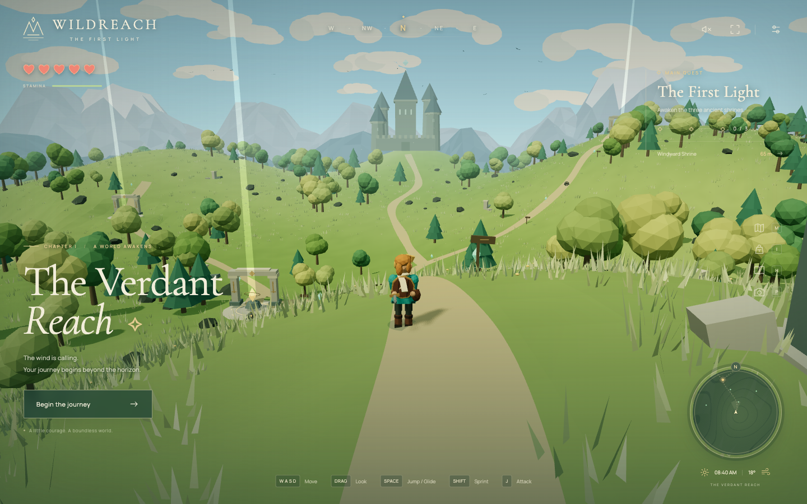

# Wildreach · The First Light

A playable, original 3D browser adventure inspired by the exploration and traversal of _The Legend of Zelda: Breath of the Wild_. Follow the trails, sail over a sunlit valley, battle stone sentinels, and awaken three ancient shrines.



All characters, scenery, interface art, and sounds are generated locally. No Nintendo artwork, models, music, or other game assets are included. Fonts are bundled, so playing does not depend on a CDN.

## Play locally

Requires Node.js **22.12+** (or **24+**) and a browser with WebGL 2.

```bash
npm ci
npm run dev
```

Open the local URL printed by Vite, then choose **Begin the journey**. Follow the path down from the starting ridge toward the golden beam at Windward Shrine. Jump, then press Space again to deploy the glider.

## The adventure

- Explore a continuous, procedurally modeled valley with forests, ruins, a lake, distant mountain ridges, and an old citadel.
- Walk, sprint, jump, climb steep terrain, and glide. Sprinting, climbing, and gliding consume stamina; resting on the ground restores it.
- Use the blade to defeat five sentinels. Three strikes defeat a sentinel and grant an apple; apples restore two hearts.
- Discover twelve spirit shards and awaken all three shrines to finish the main quest. You can keep exploring after the ending.
- Use the topographic map and minimap to navigate. Select a shrine or click the map to place a waypoint.
- Shrine activation restores health and stamina and establishes a respawn checkpoint. Discoveries survive a fall or defeat.
- Progress saves automatically to this browser every five seconds, when a menu opens, and when leaving the page. **New journey** asks for confirmation before replacing that save.
- Adjust sound and graphics quality, use fullscreen, or hide the interface for photo mode.

## Controls

| Input                    | Action                                                    |
| ------------------------ | --------------------------------------------------------- |
| WASD / arrow keys        | Move relative to the camera                               |
| Drag the scene / Q and R | Rotate the camera                                         |
| Mouse wheel              | Adjust camera distance                                    |
| Shift                    | Sprint                                                    |
| Space                    | Jump; press again in the air to deploy or fold the glider |
| J / click the scene      | Sword attack                                              |
| E                        | Gather a nearby shard or awaken a shrine                  |
| F                        | Eat an apple, including from the satchel                  |
| M                        | Open/close the map                                        |
| I                        | Open/close the satchel                                    |
| H                        | Open/close the field guide                                |
| P                        | Enter/exit photo mode                                     |
| Escape                   | Pause or close the current menu                           |

On a touchscreen, begin the journey to reveal the left movement stick and right action buttons. Drag the scene to look around; hold the ⇧ button while moving to sprint. Menus pause gameplay and trap keyboard focus. Switching away from the game also pauses it.

## Build and verify

```bash
npm run build
npm run preview
npm test
npm run test:e2e
npm run format:check
```

On a fresh test machine, install Playwright’s Chromium browser first:

```bash
npx playwright install chromium
```

The unit suite covers traversal, stamina, combat, fall damage, save validation, and a complete route through all three shrines over the actual terrain. Browser tests cover rendered gameplay, menus, save/resume, progression, and touch controls. They launch an isolated development server on port 4317 and use isolated browser storage.

## Project structure

| Module              | Responsibility                                                        |
| ------------------- | --------------------------------------------------------------------- |
| `src/main.ts`       | Game loop, input, camera, lighting, save orchestration                |
| `src/world.ts`      | Deterministic terrain and procedural scenery                          |
| `src/game-state.ts` | Rendering-independent traversal, combat, progression, save validation |
| `src/characters.ts` | Original animated character and sentinel models                       |
| `src/ui.ts`         | HUD, menus, topographic maps, accessible controls                     |
| `src/audio.ts`      | Web Audio ambient wind, notes, and effects                            |
| `src/layout.ts`     | Shared world locations                                                |

The development build exposes read-only `window.__wildreach` diagnostics for browser tests. These are omitted from production builds. Saves use the versioned `wildreach.journey.v1` localStorage key; malformed or incompatible saves are ignored safely.

This is a compact single-player adventure. Decorative trees and ruins do not have solid collision, the lake is shallow walkable terrain, and combat uses a forgiving nearby melee radius. There is no multiplayer, swimming, crafting, or dungeon system.

## License

MIT. Bundled dependencies and fonts retain their respective licenses.
